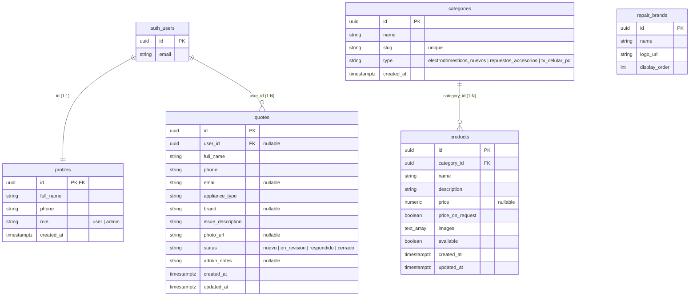

# Saba Multiservice — Supabase Backend & RLS

Este directorio contiene las migraciones de base de datos, políticas de seguridad (RLS), triggers y datos de prueba para la base de datos de Supabase de **Saba Multiservice**.

---

## 1. Estructura de Base de Datos y Relaciones

El esquema está compuesto por las siguientes tablas en el esquema `public`:



---

## 2. Cómo Ejecutar las Migraciones

Para levantar Supabase localmente y aplicar las migraciones:

1. **Instalar dependencias y levantar Supabase CLI:**
   ```bash
   pnpm supabase init
   pnpm supabase start
   ```

2. **Aplicar migraciones y base de datos:**
   El comando `db reset` recrea la base de datos local, aplica automáticamente todas las migraciones contenidas en `supabase/migrations/` y ejecuta el script de datos iniciales `supabase/seed.sql`.
   ```bash
   pnpm supabase db reset
   ```

3. **Subir cambios a tu instancia en la nube (Staging / Producción):**
   ```bash
   pnpm supabase db push
   ```

---

## 3. Cómo Promover a un Usuario a Administrador

No existe un flujo en la interfaz de usuario para registrarse como administrador (por cuestiones de seguridad). La promoción se realiza manualmente mediante una consulta SQL directa en el editor de consultas de la consola de Supabase:

```sql
-- Reemplazar '<USER_UUID>' por el id del usuario que figura en auth.users
UPDATE public.profiles 
SET role = 'admin' 
WHERE id = '<USER_UUID>';
```

---

## 4. Políticas de Seguridad (RLS) & Checklist de Verificación

Todas las tablas tienen habilitado Row Level Security (RLS). A continuación, se detalla el checklist de pruebas que garantiza la seguridad del sistema:

### Checklist de Verificación Manual (QA RLS)

#### Tabla `profiles`
- [ ] **Leer Perfil Propio (Cliente)**: Autenticado como Usuario A, intentar leer perfil de A. **Resultado esperado**: Permitido (HTTP 200).
- [ ] **Leer Perfil Ajeno (Cliente)**: Autenticado como Usuario A, intentar leer perfil de Usuario B. **Resultado esperado**: Bloqueado / Vacío (HTTP 200 con array vacío o error 406/403).
- [ ] **Acceso de Administrador**: Autenticado como Admin, intentar leer perfiles de A y B. **Resultado esperado**: Permitido (HTTP 200).
- [ ] **Autocambio de Rol (Cliente)**: Autenticado como Usuario A, intentar cambiar el campo `role` de `'user'` a `'admin'`. **Resultado esperado**: Bloqueado por el trigger `on_profile_role_updated` (Excepción: *"Solo los administradores pueden cambiar los roles."*).

#### Tablas `categories` y `products`
- [ ] **Lectura Anónima**: Sin estar autenticado, intentar consultar las categorías y productos. **Resultado esperado**: Permitido (HTTP 200).
- [ ] **Escritura Cliente/Invitado**: Intentar crear, modificar o eliminar un producto o categoría. **Resultado esperado**: Bloqueado por RLS (Error 401/403).
- [ ] **Escritura Administrador**: Autenticado como Admin, intentar crear un producto. **Resultado esperado**: Permitido (HTTP 201).

#### Tabla `quotes` (Presupuestos)
- [ ] **Envío como Invitado**: Sin autenticarse, enviar un formulario de consulta. **Resultado esperado**: Permitido (HTTP 201). El campo `user_id` se setea en `NULL` automáticamente en base de datos.
- [ ] **Envío Autenticado**: Autenticado como Usuario A, enviar una consulta. **Resultado esperado**: Permitido (HTTP 201). El trigger `handle_new_quote` fuerza que `user_id` sea exactamente `auth.uid()` (evitando suplantaciones).
- [ ] **Inyección de Admin Notes**: Intentar insertar una consulta con texto en `admin_notes`. **Resultado esperado**: El trigger lo descarta y el campo se graba como `NULL`.
- [ ] **Visualización de Consultas Propias**: Autenticado como Usuario A, solicitar presupuestos. **Resultado esperado**: Retorna únicamente las de A.
- [ ] **Visualización de Consultas Ajenas**: Autenticado como Usuario A, solicitar presupuestos con filtro de `user_id = B`. **Resultado esperado**: Retorna vacío.
- [ ] **Edición de Consulta Propia**: Autenticado como Usuario A, intentar cambiar `status` o `issue_description` de un presupuesto ya enviado. **Resultado esperado**: Bloqueado por RLS (Error 403).
- [ ] **Control Total del Administrador**: Autenticado como Admin, realizar consultas y actualizaciones de `status` y `admin_notes` en cualquier presupuesto. **Resultado esperado**: Permitido (HTTP 200).

#### Almacenamiento (Supabase Storage)
- [ ] **Bucket `product-images` (Público)**: Acceder a una imagen de producto por su URL directa. **Resultado esperado**: Permitido.
- [ ] **Bucket `product-images` (Carga/Modificación)**: Intentar subir/modificar una foto de producto como usuario no administrador. **Resultado esperado**: Bloqueado por RLS.
- [ ] **Bucket `quote-photos` (Privado - Lectura Ajena)**: Autenticado como Usuario A, intentar descargar una foto subida por el Usuario B (`user-uploads/B-uuid/foto.png`). **Resultado esperado**: Bloqueado por la política `Select Quote Photos` (Error 403).
- [ ] **Bucket `quote-photos` (Privado - Lectura Propia)**: Autenticado como Usuario A, intentar descargar su propia foto (`user-uploads/A-uuid/foto.png`). **Resultado esperado**: Permitido.
- [ ] **Bucket `quote-photos` (Lectura Administrador)**: Autenticado como Admin, intentar descargar fotos de A y B. **Resultado esperado**: Permitido.
